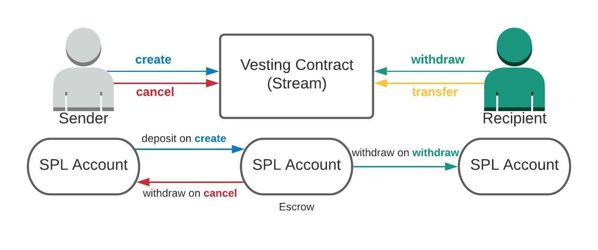

# streamflow-sdk
SDK for Rust on-chain solana programs to interact with streamflow protocol

## Usage

Declare a dependency in your program's Cargo.toml

```toml
streamflow_sdk = {version = "0.13.0-alpha.1", features = ["cpi"]}
```

To use protocol on devnet add sdk with `devnet` feature

```toml
streamflow_sdk = {version = "0.13.0-alpha.1", features = ["cpi", "devnet"]}
```

Example anchor program invoking streamflow create instruction:

```rust
use anchor_lang::{prelude::*};
use anchor_spl::{
    associated_token::AssociatedToken,
    token::{Mint, Token, TokenAccount},
};

use streamflow_sdk;
use streamflow_sdk::cpi::accounts::Create;

let accs = Create {
    sender: ctx.accounts.sender.to_account_info(),
    sender_tokens: ctx.accounts.sender_tokens.to_account_info(),
    recipient: ctx.accounts.recipient.to_account_info(),
    recipient_tokens: ctx.accounts.recipient_tokens.to_account_info(),
    metadata: ctx.accounts.metadata.to_account_info(),
    escrow_tokens: ctx.accounts.escrow_tokens.to_account_info(),
    streamflow_treasury: ctx.accounts.streamflow_treasury.to_account_info(),
    streamflow_treasury_tokens: ctx.accounts.streamflow_treasury_tokens.to_account_info(),
    withdrawor: ctx.accounts.withdrawor.to_account_info(),
    partner: ctx.accounts.partner.to_account_info(),
    partner_tokens: ctx.accounts.partner_tokens.to_account_info(),
    mint: ctx.accounts.mint.to_account_info(),
    fee_oracle: ctx.accounts.fee_oracle.to_account_info(),
    rent: ctx.accounts.rent.to_account_info(),
    timelock_program: ctx.accounts.streamflow_program.to_account_info(),
    token_program: ctx.accounts.token_program.to_account_info(),
    associated_token_program: ctx.accounts.associated_token_program.to_account_info(),
    system_program: ctx.accounts.system_program.to_account_info(),
};

let cpi_ctx = CpiContext::new(ctx.accounts.streamflow_program.to_account_info(), accs);

streamflow_sdk::cpi::create(
    cpi_ctx,
    start_time,
    net_amount_deposited,
    period,
    amount_per_period,
    cliff,
    cliff_amount,
    cancelable_by_sender,
    cancelable_by_recipient,
    automatic_withdrawal,
    transferable_by_sender,
    transferable_by_recipient,
    can_topup,
    stream_name,
    withdraw_frequency,
    pausable,
    can_update_rate
)
```

## Example program using sdk

For a more detailed example, check ./programs/example/lib.rs

## V1 vs V2 instructions

The SDK provides two variants of each create instruction: **v1** (original) and **v2** (PDA-based metadata).

### V1 (create, create_unchecked, create_unchecked_with_payer)

The metadata account is an **ephemeral signer keypair** generated client-side. The caller must create and sign with this keypair when submitting the transaction. For `create_unchecked` variants the metadata account must be pre-initialized with 1104 bytes and assigned to the program.

### V2 (create_v2, create_unchecked_v2, create_unchecked_with_payer_v2)

The metadata account is a **PDA** (Program Derived Address) created on-chain by the protocol. No keypair generation or pre-initialization is needed. The metadata PDA is derived from:

```
["strm-met", mint, payer, nonce.to_be_bytes()]
```

Use `streamflow_sdk::state::derive_metadata` to compute the address:

```rust
let (metadata_pda, _bump) = streamflow_sdk::state::derive_metadata(
    &mint_pubkey,
    &sender_pubkey, // or &payer_pubkey for create_unchecked_with_payer_v2
    nonce,
    &streamflow_sdk::id(),
);
```

The `nonce` (`u32`) allows a single sender to create multiple streams for the same mint by incrementing the nonce.

| Aspect | V1 | V2 |
|---|---|---|
| Metadata account | Ephemeral signer keypair | PDA (derived on-chain) |
| Metadata must sign? | Yes | No |
| `pausable` parameter | `Option<bool>` (create) / `bool` (unchecked) | `bool` |
| `can_update_rate` parameter | `Option<bool>` (create) / `bool` (unchecked) | `bool` |
| Extra parameter | -- | `nonce: u32` |

### Which variant to use

- **`create` / `create_v2`** -- Full checked creation with all accounts validated (17 accounts). Use when calling from a client or when account validation is desired.
- **`create_unchecked` / `create_unchecked_v2`** -- Reduced account set (10 accounts). Passes `recipient` and `partner` as instruction data instead of accounts. Recommended when creating streams from an on-chain program with limited account space.
- **`create_unchecked_with_payer` / `create_unchecked_with_payer_v2`** -- Same as unchecked but with a separate `payer` account. **Recommended when the contract sender is a PDA that cannot spend SOL** (e.g., your program's PDA is the stream sender but cannot pay rent or fees). The `payer` signer covers account initialization costs and withdrawal fees. Note: for `create_unchecked_with_payer_v2`, the metadata PDA is derived using `payer` (not `sender`).

Addresses
---

| parameter           |address|
|---------------------|----|
| program_id          |strmRqUCoQUgGUan5YhzUZa6KqdzwX5L6FpUxfmKg5m|
| fees_oracle         |B743wFVk2pCYhV91cn287e1xY7f1vt4gdY48hhNiuQmT|
| streamflow_treasury |5SEpbdjFK5FxwTvfsGMXVQTD2v4M2c5tyRTxhdsPkgDw|
| withdrawor          |wdrwhnCv4pzW8beKsbPa4S2UDZrXenjg16KJdKSpb5u|

## Streamflow protocol

Rust program that provides SPL timelock functionalities

Functionalities are:
- `create` a vesting contract.
- `create_v2` a vesting contract with PDA-based metadata.
- `create_unchecked` a vesting contract with reduced account validation.
- `create_unchecked_v2` a vesting contract with reduced account validation and PDA-based metadata.
- `create_unchecked_with_payer` a vesting contract with a separate payer.
- `create_unchecked_with_payer_v2` a vesting contract with a separate payer and PDA-based metadata.
- `update` a vesting contract.
- `withdraw` from a vesting contract.
- `cancel` a vesting contract.
- `transfer_recipient` of a vesting contract.

**Security audit passed ✅**

Protocol audit available [here](https://github.com/streamflow-finance/rust-sdk/blob/main/protocol_audit.pdf).

Partner oracle audit available here [here](https://github.com/streamflow-finance/rust-sdk/blob/main/partner_oracle_audit.pdf).

High level overview
--

